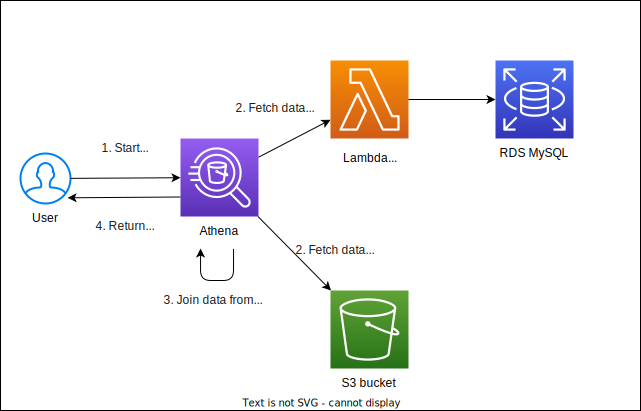
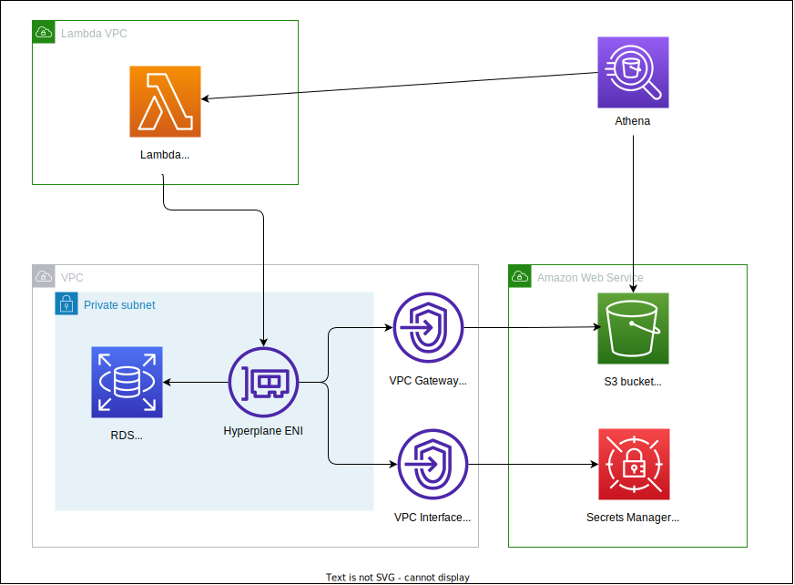
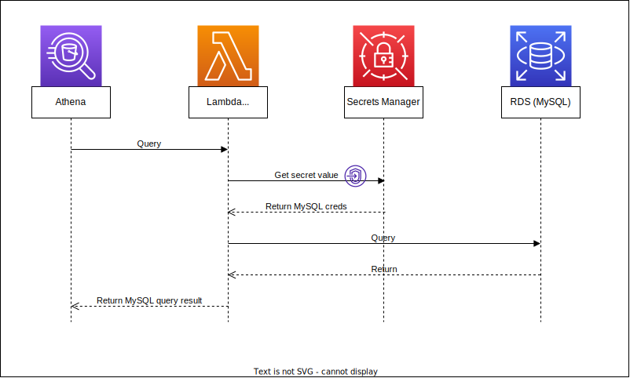

## Whole picture

### Simplified

[](./blog_athena_join_s3_and_mysql_architecture_diagram.drawio.svg)

### Network

[](./blog_athena_join_s3_and_mysql_architecture_diagram_nw.drawio.svg)

### Sequence of Athena to MySQL

[](./blog_athena_join_s3_and_mysql_secrets_sequence.drawio.svg)

## Setup IAM policies and Cloud9 to deploy the resources

See [Calling AWS services from an environment in AWS Cloud9](https://docs.aws.amazon.com/cloud9/latest/user-guide/credentials.html#credentials-temporary) for more information.

```bash
# Create a role
aws iam create-role --role-name blog-athena-join-s3-and-mysql-cloud9-instance-role --assume-role-policy-document file://cloud9_iam/trust-policy.json;

# Attach policies to the role
aws iam attach-role-policy --role-name blog-athena-join-s3-and-mysql-cloud9-instance-role --policy-arn arn:aws:iam::aws:policy/AWSCloud9SSMInstanceProfile;
aws iam attach-role-policy --role-name blog-athena-join-s3-and-mysql-cloud9-instance-role --policy-arn arn:aws:iam::aws:policy/AmazonS3FullAccess;
aws iam put-role-policy --role-name blog-athena-join-s3-and-mysql-cloud9-instance-role --policy-name blog-athena-join-s3-and-mysql-cloud9-instance-policy --policy-document file://cloud9_iam/inline-policy.json;
aws iam create-instance-profile --instance-profile-name blog-athena-join-s3-and-mysql-cloud9-instance-profile;
aws iam add-role-to-instance-profile --instance-profile-name blog-athena-join-s3-and-mysql-cloud9-instance-profile --role-name blog-athena-join-s3-and-mysql-cloud9-instance-role;

# Start Cloud9 environment and attach the role to the EC2 instance used by Cloud9
read -s c9_subnet_id; export c9_subnet_id;		# Use your own subnet id.
read -s c9_owner_arn; export c9_owner_arn;		# Use your own owner arn.
aws cloud9 create-environment-ec2 \
	--name blog-athena-join-s3-and-mysql-cloud9-environment \
	--description "Cloud9 environment for blog-athena-join-s3-and-mysql" \
	--instance-type t3.small \
	--automatic-stop-time-minutes 60 \
	--image-id amazonlinux-2023-x86_64 \
	--connection-type CONNECT_SSM \
	--subnet-id $c9_subnet_id \
	--owner-arn $c9_owner_arn;

# Disassociate default instance profile and associate the instance profile created above to the Cloud9 instance.
c9_instance_id=$(aws ec2 describe-instances --filters Name=tag:Name,Values=*blog-athena-join-s3-and-mysql-cloud9-environment* Name=instance-state-name,Values=running --query "Reservations[*].Instances[*].InstanceId" --output text);
default_iipa_id=$(aws ec2 describe-iam-instance-profile-associations --filters "Name=instance-id,Values=$c9_instance_id" --query "IamInstanceProfileAssociations[0].AssociationId" --output text);
aws ec2 disassociate-iam-instance-profile --association-id $default_iipa_id;
aws ec2 associate-iam-instance-profile --iam-instance-profile Name=blog-athena-join-s3-and-mysql-cloud9-instance-profile --instance-id $c9_instance_id;

# Lastly, disable the temporary credentials for the Cloud9 environment in the IDE.
```

## Deploy

```bash
git clone https://github.com/yuta-cmth/blog-athena-join-s3-and-mysql.git
cd blog-athena-join-s3-and-mysql
npm i
cdk deploy --require-approve never
```

```bash
bucket_name=$(aws cloudformation describe-stacks --stack-name BlogAthenaJoinS3AndMysqlStack --output text --query 'Stacks[0].Outputs[?OutputKey==`BucketName`].OutputValue')

aws s3 cp ./s3_test_data/data "s3://${bucket_name}/data" --recursive
```

### Create table in Athena

```sql
CREATE EXTERNAL TABLE blog_athena_join_s3_mysql_db.weather_data (
  year INT,
  city STRING,
  temperature INT,
  humidity INT
)
ROW FORMAT SERDE 'org.apache.hadoop.hive.serde2.OpenCSVSerde'
WITH SERDEPROPERTIES (
  'delimiter' = ',',
  'skip.header.line.count' = '1'
)
LOCATION 's3://blog-athena-join-s3-mysql-bucket/data';
```

### Run SELECT to join MySQL and S3

```sql
select year,
	m.name,
	temperature,
	humidity
from "blog_athena_join_s3_mysql_db"."weather_data" as w
	INNER JOIN "lambda:athena-mysql-connector"."blog_athena_join_s3_mysql"."master_dimension" as m ON w.city = m.key
order by year, m.name;
```

## Clean up

```bash
# Emptying the bucket. Without it, cdk destroy will fail.
aws s3 rm "s3://${bucket_name}" --recursive
cdk destroy --force

# Delete Cloud9 environment and IAM role.
aws cloud9 delete-environment --environment-id <environment_id>
aws iam remove-role-from-instance-profile --instance-profile-name blog-athena-join-s3-and-mysql-cloud9-instance-profile --role-name blog-athena-join-s3-and-mysql-cloud9-instance-role;
aws iam delete-instance-profile --instance-profile-name blog-athena-join-s3-and-mysql-cloud9-instance-profile;
aws iam detach-role-policy --role-name blog-athena-join-s3-and-mysql-cloud9-instance-role --policy-arn arn:aws:iam::aws:policy/AWSCloud9SSMInstanceProfile;
aws iam detach-role-policy --role-name blog-athena-join-s3-and-mysql-cloud9-instance-role --policy-arn arn:aws:iam::aws:policy/AmazonS3FullAccess;
aws iam delete-role-policy --role-name blog-athena-join-s3-and-mysql-cloud9-instance-role --policy-name blog-athena-join-s3-and-mysql-cloud9-instance-policy;
aws iam delete-role --role-name blog-athena-join-s3-and-mysql-cloud9-instance-role;
```

## References

- https://catalog.us-east-1.prod.workshops.aws/workshops/9981f1a1-abdc-49b5-8387-cb01d238bb78/en-US/20-howtostart/201-self-paced/2013-cloudformation
- https://aws.amazon.com/blogs/infrastructure-and-automation/use-aws-cdk-to-initialize-amazon-rds-instances/
- https://www.kaggle.com/datasets/rushikeshdane20/global-trends-in-atmospheric-carbon-dioxide
- https://serverlessrepo.aws.amazon.com/applications/us-east-1/292517598671/AthenaMySQLConnector
